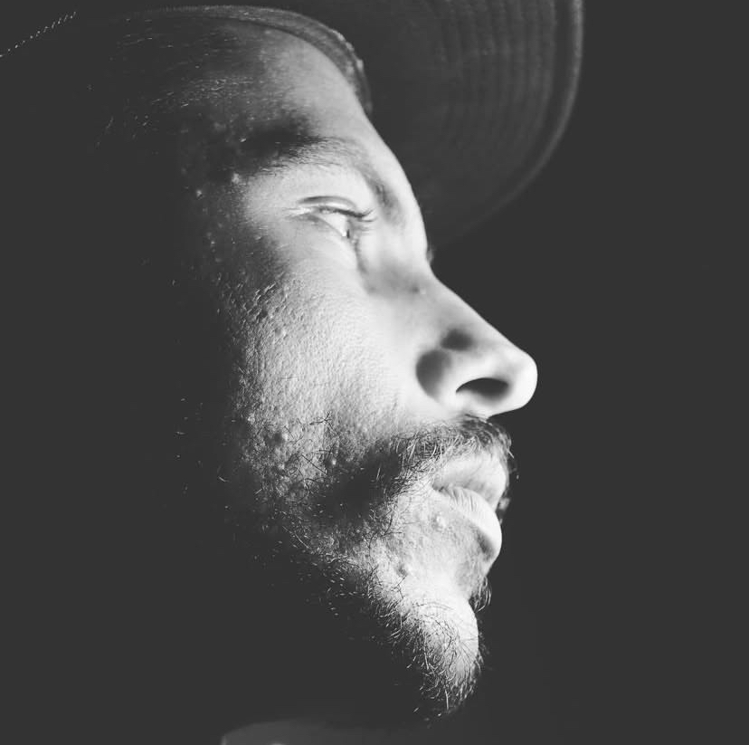

# Lucas Cardozo

Creative technologist and founder of [CardoLAB Studio](https://www.cardolab.studio/).

I work at the intersection of software engineering, brand systems, motion design, and AI-assisted production. My focus is building digital products that are useful, maintainable, visually sharp, and ready to evolve after the first release.

## Current Focus

- Building CardoLAB Studio as a production-grade creative technology studio.
- Developing private client and studio repositories with clean documentation, CI, security notes, and release discipline.
- Turning brand, audiovisual, and product references into structured web systems.
- Exploring AI-assisted workflows for design, development, motion, and operations.

## Working Principles

- Clear repository structure before scale.
- Documentation that helps future maintainers move faster.
- CI, validation, and environment hygiene as part of the craft.
- Visual systems that respect brand identity instead of chasing generic trends.
- Private-by-default for client, commercial, and unfinished work.

## Core Stack

`Next.js` `React` `TypeScript` `Tailwind CSS` `Supabase` `Vercel` `GitHub Actions` `Node.js` `Python`

## Creative Stack

`Figma` `After Effects` `Premiere Pro` `DaVinci Resolve` `Blender` `Photoshop` `Brand Systems` `Motion Design`

## Selected Workspaces

- `cardolabstudio`: production website, CMS, maintenance mode, and deployment workflow for CardoLAB Studio.
- `VisusStudio`: brand system and future website planning workspace for an audiovisual studio.
- `LimaSurfConcept`: brand/case-study reference workspace for future web development.
- `Aira`: local-first Windows gesture and voice assistant MVP.
- `DirectorX`: AI-assisted video editing and EDL planning prototype.
- `SentinelFlow`: security operations and patrol management MVP.

Most active product and client repositories are private while they are being shaped, validated, and prepared for release.

## Contact

- Website: [cardolab.studio](https://www.cardolab.studio/)
- LinkedIn: [lucasvieiracardozo](https://www.linkedin.com/in/lucasvieiracardozo)
- Email: [contact@cardolab.studio](mailto:contact@cardolab.studio)
